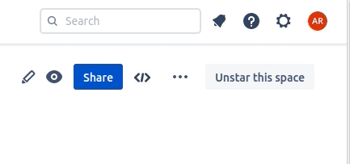

# Relative image path example

# Relative path example

[Relative Link](ЧИТАЙ.md)

# Absolute url image example

# Absolute raw url image example

# Absolute permalink url image example

# Absolute redirect raw url

# Absolute external url image example

